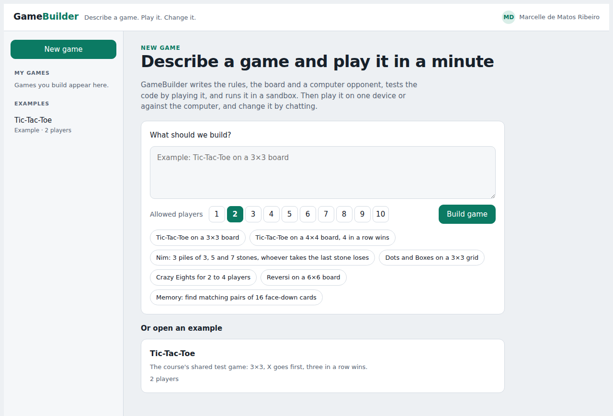
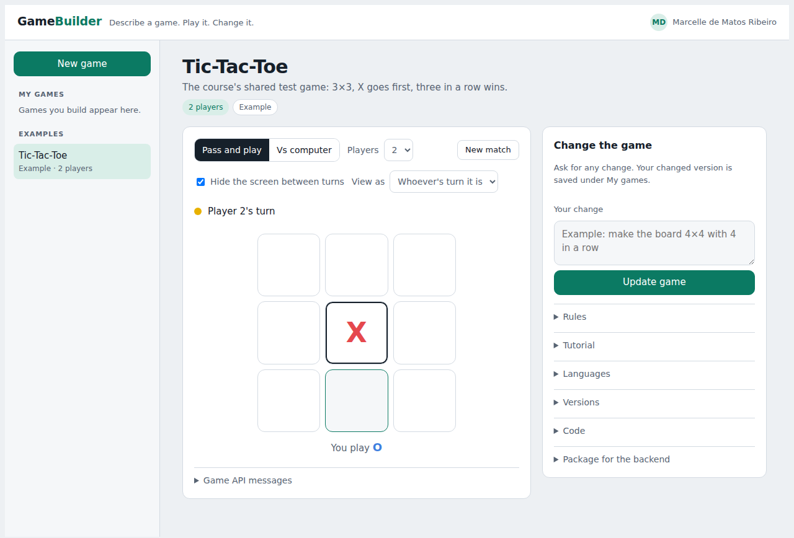
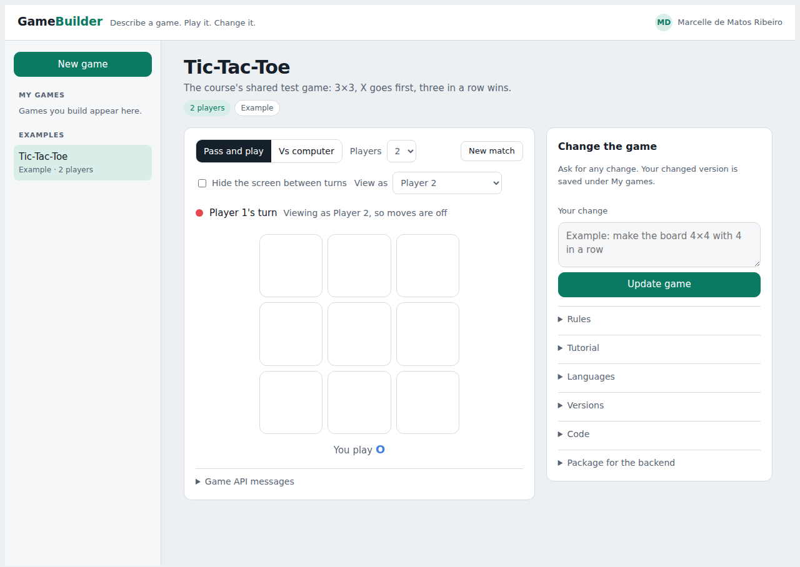
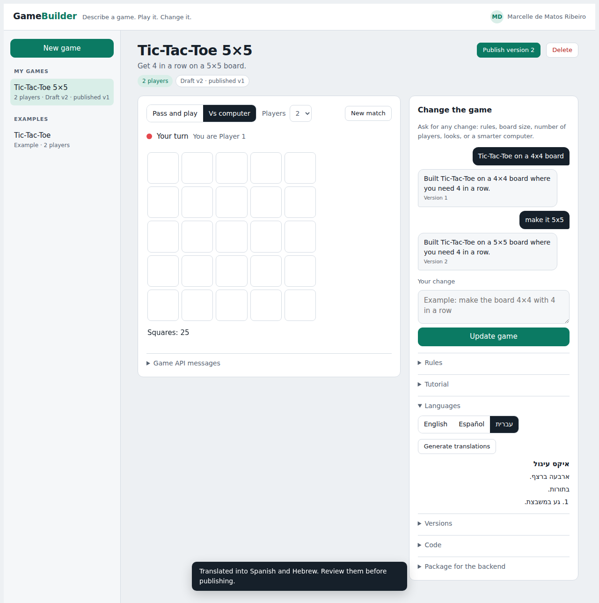
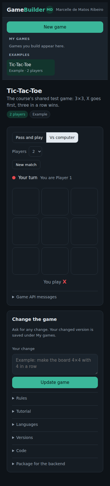

# GameBuilder

Describe a turn-based game in plain words. GameBuilder writes it with AI, playtests it automatically in a sandbox, and lets you play it on one device (pass-and-play) or against the computer. Then you change it by chatting.

GameBuilder is the creator side of the group platform in **Multiplayer Games** (Columbia University, Fall 2026). It produces game packages that follow the platform's shared JSON contract, so the web, Android, iOS and React Native portals can run them.



## What it does

| Step (from the course spec) | In GameBuilder |
|---|---|
| **Describe** the rules | Type a description and choose the allowed player totals (for example 2, 3 or 6, a set rather than a range). |
| **Generate** artifacts | The AI writes the game logic, the board UI, a computer opponent, the rules, a description and a tutorial. |
| **Test** in the emulator | Every new version is played automatically before you see it. If a playtest finds a bug, the error goes back to the AI for one fix. Then play it yourself in pass-and-play (with "pass the device" screens) or against the computer. **View as** shows any seat's perspective, with input disabled when it isn't that seat's turn. |
| **Refine** | Chat to change rules, board size, players or looks. Each change is a new version, and any earlier version can be restored. |
| **Publish** | Freeze a version ("Published v2"). Editing continues as a draft ("Draft v3 · published v2"). |
| **Languages** | Generate Spanish and Hebrew rules and tutorials for review. Hebrew displays right-to-left. |
| **My games** | Create, open and delete your games. They are saved privately per user. |

Tic-Tac-Toe, the course's shared test game, is built in as an example. Its moves use the same format as the backend's reference engine: `{"type": "place", "cell": 0-8}`.

## How it works

```
┌──────────────────────── GameBuilder page (trusted container) ───────────────────────┐
│  chat · versions · publish · match controls                                          │
│                                                                                      │
│   state_change ─────────────►  ┌───────────────────────────────┐                     │
│                                │ Game package                  │  sandboxed iframe   │
│   ◄────────────── make_move    │ (generated code + runtime)    │  allow-scripts only │
│                                └───────────────────────────────┘  (separate origin)  │
│                                                                                      │
│   Rules check + playtests ───► Web Worker running the same game code (no DOM access) │
└──────────────────────────────────────────────────────────────────────────────────────┘
```

- **Game package.** Each game version runs in its own sandboxed iframe. The page and the game communicate only through the course's JSON messages.

  Container → game:
  ```json
  { "message_kind": "state_change", "state": { }, "turn_of_user": { "player_index": 1, "kind": "human" },
    "my_user": { "player_index": 1, "kind": "human" }, "players": [ { "player_index": 0, "kind": "human" } ] }
  ```
  Game → container:
  ```json
  { "message_kind": "make_move", "turn_of_player_index": 0, "next_state": { } }
  ```
  `turn_of_user` is `null` when the game is over. It is a player's turn only when `turn_of_user.player_index === my_user.player_index`.

- **Rules check.** The page re-checks every proposed move against the game's rules in a Web Worker before accepting it, the way a backend would. The worker also runs the computer opponent and the automatic playtests, with a time limit so a stuck game can't freeze the page.
- **Fallback.** If a view can't start the iframe, the page draws the game itself from sanitized HTML (scripts, event handlers and external resources removed). The message log says which mode is running.
- **Game format.** The AI writes every game to one small contract (`init`, `currentPlayer`, `legalMoves`, `applyMove`, `result`, `computerMove`, `render`). See [docs/game-contract.md](docs/game-contract.md).
- **Backend package.** Each game shows the JSON bodies for the backend's `POST /games` and `POST /games/{id}/versions`, including `manifest.players.allowedCounts`. The game code is in `rulesArtifact`, using the published version when there is one.

## Screenshots

| Pass-and-play | View as another player |
|---|---|
|  |  |

| Versions, publish and languages | Phone, dark mode |
|---|---|
|  |  |

## Project layout

```
src/
  index.html      the page: UI, build pipeline, iframe packaging, emulator
  harness.js      runs inside the Web Worker: rules checks, computer moves, playtests
  examples.js     built-in Tic-Tac-Toe, written to the same contract as AI games
scripts/
  build.js        inlines harness.js and examples.js into dist/gamebuilder.html
tests/
  harness.test.js            game contract, playtests, illegal moves, computer opponent
  browser_fallback_test.py   end to end in Chromium (build, auto-fix, play, save, sanitizing)
  browser_iframe_test.py     end to end in iframe mode (messages, View as, publish, languages)
  fake-replies.js            canned AI replies, including one with a deliberate bug
docs/
  game-contract.md
  screenshots/
```

## Build and test

Requires Node 22.6 or later. The browser tests also need Python 3 with Playwright and Chromium.

```bash
npm run build          # writes dist/gamebuilder.html
npm test               # game contract and playtest tests (Node)
npm run test:browser   # builds, then runs both end-to-end suites in headless Chromium
```

The browser tests replace the AI and storage with local stand-ins, so they run offline and give the same result every time.

## Running it

`dist/gamebuilder.html` is published as a Claude artifact. In that environment the page gets three services from the host: AI generation on the signed-in user's Claude account, a private per-user store for saved games, and the user's name. Opened anywhere else, it still runs the built-in example, but building and saving are turned off.

## Status and next steps

Done: describe → generate → playtest → play → refine → publish, the iframe message contract, View as, tutorial, translations, and the backend package.

Next:
1. **Google login.** The course spec asks for Google sign-in. Right now identity comes from the Claude account. The plan is Firebase Authentication on self-hosted pages, the same stack the portals use.
2. **Publish to the backend.** Send the package to the shared backend once it is deployed, instead of copying the JSON by hand.
3. **Separate-origin hosting for game packages.** Serve packages from their own domain so the portals can load the same files.

## Credits

Course design and platform specification: Dr. Yoav Zibin.
